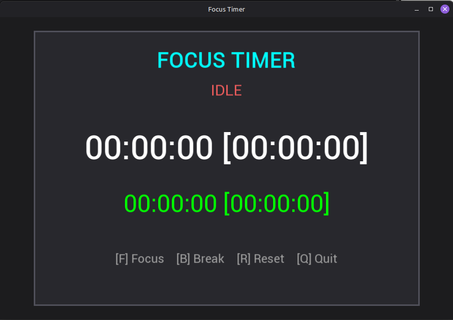

# Flow Stopwatch

Flowing Time is a lightweight and flexible focus timer designed for people who find traditional Pomodoro timers too restrictive. 
Instead of forcing fixed work and break intervals, it lets you work for as long as you remain focused while tracking your total focus time.
Based on the time you've spent working, the application rewards you with a proportional amount of break time.

The goal is to encourage sustainable productivity without interrupting your workflow.

## Dependencies

- **Linux** system
- **CMake 3.16** or newer
- **SFML 2.5** 


## Building

### 1. Clone the repository

```bash
git clone https://github.com/Hishmann/Flowing-Time.git
cd flowing_time
```

### 2. Configure the project

```bash
cmake -S . -B build
```

### 3. Build

```bash
cmake --build build
```

### 4. Run

Run the generated executable from the build directory.

### 5. Preview


